-------------------------------------------------------------------------------------------------

Welcome to my cozy little room. I’m a junior full-stack JavaScript developer. There isn’t much to see here, but don’t forget to brew yourself a cup of coffee first.

- 🎓 Bootcamp Hacktiv8 - Full Stack JavaScript Program
- 📍 Bekasi, Indonesia 
-------------------------------------------------------------------------------------------------
## 🛠️ Tech Stack

  

  

-------------------------------------------------------------------------------------------------

## 📚 Currently Learning

  

-------------------------------------------------------------------------------------------------

## 🤝 Let's Connect

<!--
**HarizDizaSantoso/HarizDizaSantoso** is a ✨ _special_ ✨ repository because its `README.md` (this file) appears on your GitHub profile.

Here are some ideas to get you started:

- 🔭 I’m currently working on ...
- 🌱 I’m currently learning ...
- 👯 I’m looking to collaborate on ...
- 🤔 I’m looking for help with ...
- 💬 Ask me about ...
- 📫 How to reach me: ...
- 😄 Pronouns: ...
- ⚡ Fun fact: ...
-->
